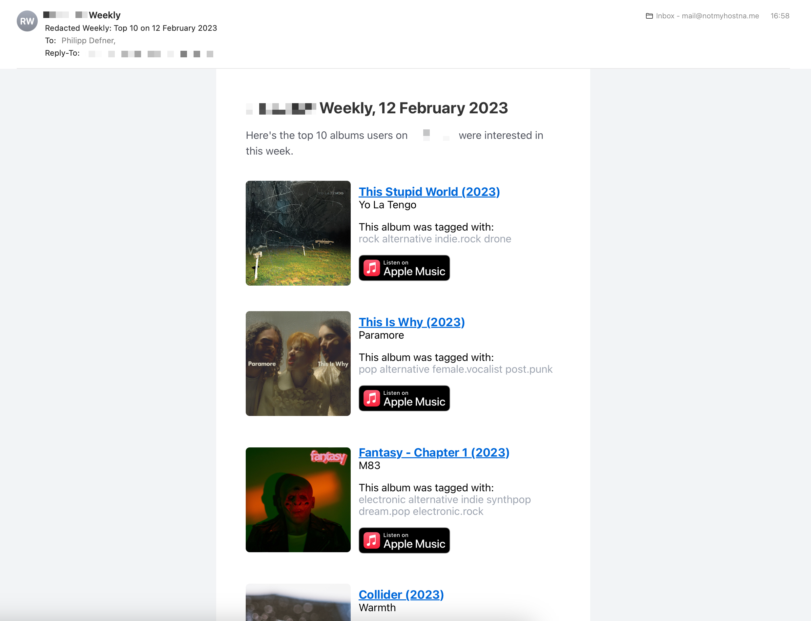

# Gazelle Weekly

A small script sending a weekly email summary of the Top 10 entries on a Gazelle-based site. The idea is to replicate the discovery experience of a website like that in the age of streaming.

## Usage

Set the environment variables, make sure the `FROM_EMAIL` is your verified sender domain on [Postmark](https://postmarkapp.com).

```
export POSTMARK_API_TOKEN="1-2-3-4"
export GAZELLE_API_TOKEN="5-6-7-8"
export GAZELLE_BASE_URL="example.com"
export FROM_EMAIL="mail@example.com"
export TO_EMAIL="mail@example.com"
```

Run `go build` and execute the binary in a cron job, with the correct environment variables set.

## Screenshot

A summary like that will land in your email inbox every time the script is executed.



## Contributing

If you want to update the email templates you have to run `npm run build ` in the `email-template` directory. This will build the final HTML in the `dist/` directory. Copy everything within the `<body>` tags into the template on [Postmark](https://account.postmarkapp.com/servers/10274778/templates/30755957/edit). The ID of the Postmark template is currently hardcoded in the `postmark.go`.